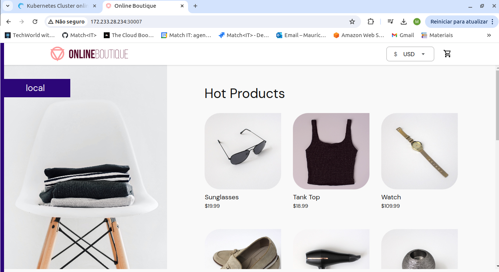

# Demo Project

Deploy Microservices application in Kubernetes with Production & Security Best Practices

## Technologies Used

Kubernetes, Redis, Linux, Linode LKE

## Project Description

- Create K8s manifests for Deployments and Services for all microservices of an online shop application
- Deploy microservices to Linode’s managed Kubernetes cluster

### Details of project

- Deployment and Service Configuration of Microservices

  In this step, a single config.yaml file will be used to define all deployments and services for the 10 microservices in the application, along with a deployment for Redis. The configurations will include the names of the microservices, their interconnections, the environment variables required to run the application, and the accessible ports.

  - Email Service

    Image: gcr.io/google-samples/microservices-demo/emailservice:v0.8.0
    Container port: 8080
    Service port: 5000
    Env: PORT=8080

  - Product Catalog Service (connects to the product catalog service)

    Image: gcr.io/google-samples/microservices-demo/productcatalogservice:v0.8.0
    Container and Service port: 3550
    Env: PORT=3550

  - Recommendation Service (connects to the product catalog service)

    Image: gcr.io/google-samples/microservices-demo/recommendationservice:v0.8.0
    Container and Service port: 8080
    Env: PORT=8080
    Env: PRODUCT_CATALOG_SERVICE_ADDR="productcatalogservice:3550"

  - Payment Service

    Image: gcr.io/google-samples/microservices-demo/paymentservice:v0.8.0
    Container and Service port: 50051
    Env: PORT=50051
    Env: DISABLE_PROFILER=1

  - Currency Service

    Image: gcr.io/google-samples/microservices-demo/currencyservice:v0.8.0
    Container and Service port: 7000
    Env: PORT=7000
    Env: DISABLE_PROFILER=1

  - Shipping Service

    Image: gcr.io/google-samples/microservices-demo/shippingservice:v0.8.0
    Container and Service port: 50051
    Env: PORT=50051

  - Ad Service

    Image: gcr.io/google-samples/microservices-demo/adservice:v0.8.0
    Container and Service port: 9555
    Env: PORT=9555

  - Redis Service

    Image: redis:alpine (Docker Hub)
    Container and Service port: 6379

  - Cart Service (connects to Redis)

    Image: gcr.io/google-samples/microservices-demo/cartservice:v0.8.0
    Container and Service port: 7070
    Env: PORT=7070
    Env: REDIS_ADDR="redis-cart:6379"

  - Checkout Service (connects to 6 microservices)

    Image: gcr.io/google-samples/microservices-demo/checkoutservice:v0.8.0
    Container and Service port: 5050
    Env: PORT=5050
    Multiple connection variables: PRODUCT_CATALOG_SERVICE_ADDR, SHIPPING_SERVICE_ADDR, PAYMENT_SERVICE_ADDR, EMAIL_SERVICE_ADDR, CURRENCY_SERVICE_ADDR, CART_SERVICE_ADDR

  - Frontend (connects to 7 microservices)

    Image: gcr.io/google-samples/microservices-demo/frontend:v0.8.0
    Container and Service port: 8080
    Node port: 30007
    Multiple connection variables for other services.

- Deploy Microservices to K8s Cluster
  A Kubernetes cluster was created on Linode, with the connection file downloaded and secured with chmod 400. The environment was set with export KUBECONFIG to use the Linode configuration file.

  Steps:

  Create a namespace for the microservices deployment:

  ```
    kubectl create ns microservice
  ```

  Deploy the services:

  ```
    kubectl apply -f config.yaml -n microservice
  ```

  Once deployed, the application can be accessed via any IP address of the 3 Linode nodes on port 30007.

  

- Kubernetes Deployment Best Practices

  Pinned Tag Versions for Container Images: All images are pinned to a specific version, here v0.8.0, to ensure consistent deployments.

  Liveness Probe for Each Container: Enables Kubernetes to monitor application health and restart containers when necessary.

  ```
    livenessProbe:
      grpc:
        port: 8080
      periodSeconds: 5
  ```

  Readiness Probe for Each Container: Ensures that containers are only marked as ready when they are ready to receive traffic.

  ```
    readinessProbe:
      grpc:
        port: 3550
      periodSeconds: 5
  ```

  Different protocols, like HTTP for frontend and TCP for Redis, were configured as needed.

  Resource Requests and Limits: Sets CPU and memory requests and limits to manage resource allocation.

  ```
    resources:
      requests:
        cpu: 70m
        memory: 200Mi
      limits:
        cpu: 125m
        memory: 300Mi
  ```
    
  Avoid NodePort Exposure: NodePort is insecure as it opens ports on all worker nodes. Instead, use a LoadBalancer service or Ingress to manage single-entry points.

  Multiple Replicas per Pod: Ensures high availability by having at least two replicas for each microservice.

  Multiple Worker Nodes: Protects against downtime if a single server fails or requires maintenance.

  Use of Labels and Namespaces: Labels group related pods, while namespaces isolate components and facilitate cluster management, providing flexible access control across teams.

